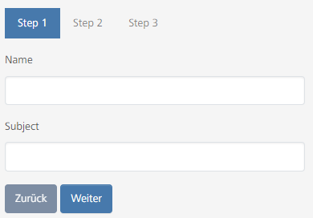

# yii2-form-wizard

A Yii2 form-wizard widget for bootstrap 5



## Features

- Bootstrap 5
- Client side validation, with the option to validate each step separately

## Installation

The preferred way to install this extension is through [composer](http://getcomposer.org/download/).

Either run

```bash
php composer.phar require --prefer-dist sandritsch91/yii2-form-wizard
```

or add

```json
"sandritsch91/yii2-form-wizard": "*"
```

to the require section of your composer.json

## Usage

```php
use sandritsch91\yii2-form-wizard\FormWizard;

echo FormWizard::widget([
    // required
    'model' => $model,                                                          // The model to be used in the form
    'tabOptions' => [                                                           // These are the options for the Bootstrap Tab widget                                        
        'items' => [
            [
                'label' => 'Step 1',                                            // The label of the tab, if omitted, a default-label will be used (Step 1, Step 2, ...)
                'content' => $this->render('_step1', ['model' => $model]),      // Either the content of the tab
            ],
            [
                'label' => 'Step 2',
                'view' => '/test/_step2',                                       // or a view to be rendered. $model and $form are passed to the view
                'params' => ['a' => 1, 'b' => 2]                                // Pass additional parameters to the view
            ]
        ],
        'navType' => 'nav-pills'
    ],
    // optional
    'validateSteps' => [                                                        // Optional, pass the fields to be validated for each step.                 
        ['name', 'surname'],
        [],                                                                     // Leave array empty if no validation is needed  
        ['email', 'password']
    ],
    'options' => [],                                                            // Wizard-container html options
    'formOptions' => [],                                                        // Form html options
    'buttonOptions' => [                                                        // Button html options
        'previous' => [
            'class' => ['btn', 'btn-secondary'],
            'data' => [
                'formwizard' => 'previous'                                      // If you change this, make sure the clientOptions match
            ]
        ],
        'next' => [...],
        'finish' => [...]
    ],
    'clientOptions' => [                                                        // Client options for the form wizard, if you need to change them
        // 'finishSelector' => '...',
        // 'nextSelector' => '...',
        // 'previousSelector' => '...',
        // 'keepPosition' => true                                               // Keep scroll position on step change.
                                                                                // Set to false to disable, or pass a selector if you have a custom scroll container.
                                                                                // Defaults to true.
    ],
    'clientEvents' => [                                                         // Client events for the form wizard
        // 'onNext' => 'function () {...}',
        // 'onPrevious' => 'function () {...}',
        // 'onFinish' => 'function (){...}'
    ]
]);
```

## Contributing

Contributions are welcome.

If you have any questions, ideas, suggestions or bugs, please open an issue.

### Testing

This package uses codeception for testing. To run the tests, run the following commands:

```php.exe .\vendor\bin\codecept run``` for all test suites

#### Unit tests

run ```php.exe .\vendor\bin\codecept run Unit``` in the root directory of this repository.

#### Functional tests

run ```php.exe .\vendor\bin\codecept run Functional``` in the root directory of this repository.

#### Accpetance tests

To be able to run acceptance tests, a few requirements are needed:

For Windows:\

- install java runtime environment
- install nodejs
- install selenium-standalone: `npm install -g selenium-standalone`
- start selenium-standalone: `selenium-standalone install && selenium-standalone start`
- host a yii2 application on a server or locally via ```./yii serve```
    - add this plugin as a dependency to your ```composer.json``` and update dependencies
    - site must be reachable over http://formwizard.com/
    - add an action ```actionTest``` to the ```SiteController```, as described below
    - this action must return a view file, as described below
    - run ```php.exe .\vendor\bin\codecept run Acceptance```

For Linux:  
Never did that before, but I think it is similar to the Windows setup.

The action in the SiteController:

```php
public function actionTest(): string
{
    include __DIR__ . '/../vendor/sandritsch91/yii2-widget-form-wizard/tests/Support/Data/models/User.php';

    $model = new User();

    if (Yii::$app->request->post() && $model->load(Yii::$app->request->post()) && $model->validate()) {
        return 'success';
    }

    return $this->render('test', [
        'model' => new User()
    ]);
}
```

The view returned by the action:

```php
/** @var User $model */

use sandritsch91\yii2\formwizard\FormWizard;
use sandritsch91\yii2\formwizard\tests\Support\Data\models\User;

$wizard = FormWizard::widget([
    'model' => $model,
    'tabOptions' => [
        'options' => [
            'class' => 'mb-3'
        ],
        'items' => [
            [
                'label' => 'Step 1',
                'view' => '@app/vendor/sandritsch91/yii2-widget-form-wizard/tests/Support/Data/views/site/step1',
                'linkOptions' => [
                    'id' => 'step1-link',,
                    'params' => [
                        'test' => 'some test variable'
                    ]
                ]
            ],
            [
                'label' => 'Step 2',
                'view' => '@app/vendor/sandritsch91/yii2-widget-form-wizard/tests/Support/Data/views/site/step2',
                'linkOptions' => [
                    'id' => 'step2-link',
                ]
            ],
            [
                'label' => 'Step 3',
                'view' => '@app/vendor/sandritsch91/yii2-widget-form-wizard/tests/Support/Data/views/site/step3',
                'linkOptions' => [
                    'id' => 'step3-link',
                ]
            ]
        ],
        'navType' => 'nav-pills'
    ],
    'validateSteps' => [
        ['firstname', 'lastname'],
        ['username', 'password', 'password_validate'],
        ['email']
    ],
    'clientOptions' => [
        'keepPosition' => true
    ]
]);

echo \yii\helpers\Html::tag('div', $wizard, [
    'class' => 'col-4'
]);
```

After the initial installation, you only have to start the selenium-standalone server ```selenium-standalone start```
and run the tests ```php.exe .\vendor\bin\codecept run Acceptance``` in the root directory of this repository.

If you do not want to setup an application, just run the unit and functional tests by
running ```php.exe .\vendor\bin\codecept run Unit,Functional```, I can modify and run the acceptance tests for you,
after you opened a pull request.
