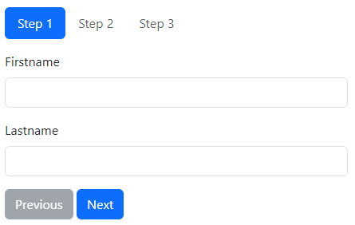

# yii2-form-wizard

A Yii2 form-wizard widget for bootstrap 5



## Features

- Bootstrap 5
- Client side validation, with the option to validate each step separately

## Installation

The preferred way to install this extension is through [composer](http://getcomposer.org/download/).

Either run

```bash
php composer.phar require --prefer-dist sandritsch91/yii2-form-wizard
```

or add

```json
"sandritsch91/yii2-form-wizard": "*"
```

to the require section of your composer.json

## Usage

```php
use sandritsch91\yii2-form-wizard\FormWizard;

echo FormWizard::widget([
    // required
    'model' => $model,                                                          // The model to be used in the form
    'tabOptions' => [                                                           // These are the options for the Bootstrap Tab widget                                        
        'items' => [
            [
                'label' => 'Step 1',                                            // The label of the tab, if omitted, a default-label will be used (Step 1, Step 2, ...)
                'content' => $this->render('_step1', ['model' => $model]),      // Either the content of the tab
            ],
            [
                'label' => 'Step 2',
                'view' => '/test/_step2',                                       // or a view to be rendered. $model and $form are passed to the view
            ]
        ],
        'navType' => 'nav-pills'
    ],
    // optional
    'validateSteps' => [                                                        // Optional, pass the fields to be validated for each step.                 
        ['name', 'surname'],
        [],                                                                     // Leave array empty if no validation is needed  
        ['email', 'password']
    ],
    'options' => [],                                                            // Wizard-container html options
    'formOptions' => [],                                                        // Form html options
    'buttonOptions' => [                                                        // Button html options
        'previous' => [
            'class' => ['btn', 'btn-secondary'],
            'data' => [
                'formwizard' => 'previous'                                      // If you change this, make sure the clientOptions match
            ]
        ],
        'next' => [...],
        'finish' => [...]
    ],
    'clientOptions' => [                                                        // Client options for the form wizard, if you need to change them
        // 'finishSelector' => '...',
        // 'nextSelector' => '...',
        // 'previousSelector' => '...',
    ],
    'clientEvents' => [                                                         // Client events for the form wizard
        // 'onNext' => 'function () {...}',
        // 'onPrevious' => 'function () {...}',
        // 'onFinish' => 'function (){...}'
    ]
]);
```

## Contributing

Contributions are welcome.

If you have any questions, ideas, suggestions or bugs, please open an issue.
